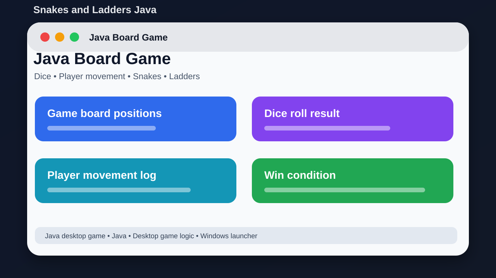

# Snakes and Ladders Java



## Short Description

A simple Java desktop version of the classic Snakes and Ladders board game.

## About This Project

Snakes and Ladders Java is a beginner-friendly desktop game project. It shows basic Java game logic, dice movement, board positions, snakes, ladders, and simple program structure.

The goal is to keep the project easy to understand, easy to run, and useful for learning or further development.

## Main Features

- Classic Snakes and Ladders gameplay
- Dice movement logic
- Board position rules
- Snakes and ladders movement
- Windows launcher file
- Runtime game log
- Project report PDF

## Tech Stack

- Java
- Desktop game logic
- Windows launcher

## Project Location

Main local folder:

```text
D:\PROJECTS\SnakesAndLaddersJava
```

GitHub repository:

https://github.com/saifalian/SnakesAndLaddersJava

## Project Structure

```text
SnakesAndLaddersGame.java          Main Java source
launch_game.bat                    Windows launcher
SnakesAndLadders_Project_Report.pdf Project report
README.md                          Project documentation
```

## How To Run

1. Compile with javac SnakesAndLaddersGame.java.
2. Run with java SnakesAndLaddersGame.
3. Or use launch_game.bat on Windows.

## Screenshot

The image above is a clean project preview for GitHub. It shows the main idea of the project in a simple way.

## Build Check

Build check: javac successfully compiled SnakesAndLaddersGame.java on the local machine.

## Current Status

This project is uploaded to GitHub and prepared as a portfolio-style repository. More improvements can be added later, such as real app screenshots, demo videos, releases, and issue templates.

## Safety Note

This is a learning game project. It does not need special permissions.

## License

No license file is included yet. Add a license before using this project as an open-source project.
